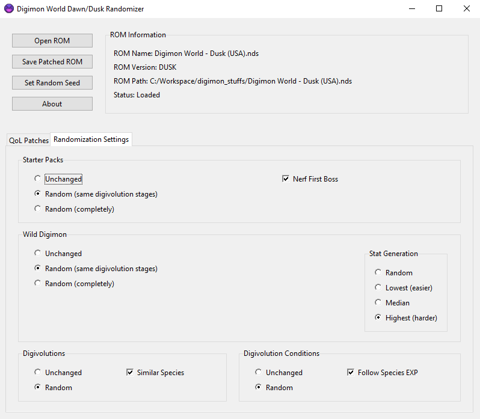

# Digimon World Dawn / Dusk Randomizer

Randomizer and quality-of-life feature patcher for the games **Digimon World: Dawn** and **Digimon World: Dusk**.

The information presented in these pages refers to the USA roms (serial codes NTR-A6RE-USA and NTR-A3VE-USA for Dusk and Dawn respectively).

## Contents
- [How To Use](#how-to-use)
    - [Windows](#windows)
- [Features](#features)
    - [Quality-of-Life Patches](#quality-of-life-patches)
    - [Randomization Settings](#randomization-settings)
- [Contact](#contact)
- [Acknowledgements](#acknowledgements)
- [Copyright Notice](#copyright-notice)

## How To Use

### Windows

1. Download the [latest release](https://github.com/joaomlsantos/DWDDRandomizer/releases/tag/0.1.0) of the randomizer tool.
2. Unpack the downloaded files and launch `DWDDRandomizer.exe`.
3. Click `Open ROM` and open a valid .nds ROM of your game.
4. Pick your quality-of-life and/or randomization features and click `Save Changes`. Give a name to your new patched ROM and choose the directory where to save the ROM, and click `Save`. A new .nds ROM will be generated with the chosen changes.

## Features

### Quality-of-Life Patches

Digimon World: Dawn and Dusk are both very charming games that also happen to have a set of very frustrating issues, the most glaring being how grind-heavy and slow-paced the games are. 

If you've played these games before, chances are that you recall some of the most negative points:
- Being constantly underleveled and having to grind encounters endlessly to keep up with the pace of the game; 
- Trying to reach an objective while in a dungeon and being completely swarmed with encounters;
- Feeling like the overall pacing of the game is *too slow*.

This tool aims to solve the above problems and provide a better game experience to everyone who plays this game, be it for the first time or as a re-run.

The following [**quality-of-life patches**](https://github.com/joaomlsantos/DWDDRandomizer/wiki/QoL-Patches) have been implemented so far:

**Grinding Reduction**
- Increased Exp Yield for Wild Digimon
- Increased Scan Rate
- Reduced Wild Encounter Rate

**Pacing Improvements**
- Increased Text Speed
- Increased Player Movement Speed

**Misc.**
- Expanded Player Name Length (from 5 to 7 characters)

### Randomization Settings

The following [**randomization options**](https://github.com/joaomlsantos/DWDDRandomizer/wiki/Randomizer-Options) have been implemented so far:
- Starter Packs
- Wild Digimon
- Digivolutions
- Digivolution Conditions

See [this page](near-future-randomization-options-link) for more details about the current randomization options and work-in-progress.

## Known Issues

- If you have an existing save file for your game, the digivolution + digivolution conditions randomization may cause visual issues on your current save file.
- Similar to the above, the player name length expansion patch is meant for new-game roms. Loading an existing base-game save into a patched rom may also cause visual issues.

## Run From Source
This application was built with Python 3.9.0, but most other versions of Python3 should be compatible.

### Steps:

1. Ensure you have Python 3 installed on your system. If it is not installed, download it from [python.org](https://www.python.org/).
2. Clone or download this repository to your computer.
3. Install the required packages by running `pip install -r requirements.txt` .
4. Launch the application by executing `python ui_tkinter.py` .

## Contact

For bug reports, questions or suggestions, please reach out via Issues or [joao.l.santos@tecnico.ulisboa.pt](mailto:joao.l.santos@tecnico.ulisboa.pt).

## Acknowledgements

Most of the research work for this game was accomplished using [HxD](https://mh-nexus.de/en/hxd/), [DeSmuME](https://desmume.org/) and [Ghidra](https://ghidra-sre.org/).

The implemented user interface was heavily inspired by [Universal Pokémon Randomizer's](https://github.com/Ajarmar/universal-pokemon-randomizer-zx) design.

Special thanks to [@Dreaker](https://github.com/Dreaker75), who composed a set of thorough [code notes](https://retroachievements.org/codenotes.php?g=16152) for these games and has been supporting this project's efforts through brainstorming, feature testing and listening to me yap about ROM editing for hours [:

## Support

This randomizer and the resources behind it are the result of countless hours of work and a deep passion for the Digimon series. If you’ve enjoyed using the tool, found the Wiki helpful, or simply want to support my efforts, consider contributing on Ko-fi.

Your support helps me continue working on projects like this, improving the tools, and sharing insights with the community. Thank you!

## Copyright Notice
Digimon World: Dawn/Dusk are owned by Bandai Namco Entertainment. I do not own, nor do I claim any rights to, the original game assets, code, or intellectual property associated with Digimon World Dawn and Digimon World Dusk. 

This repository and the tools within are provided for educational and personal use only. They are not intended for commercial use, nor for redistribution of copyrighted game assets.