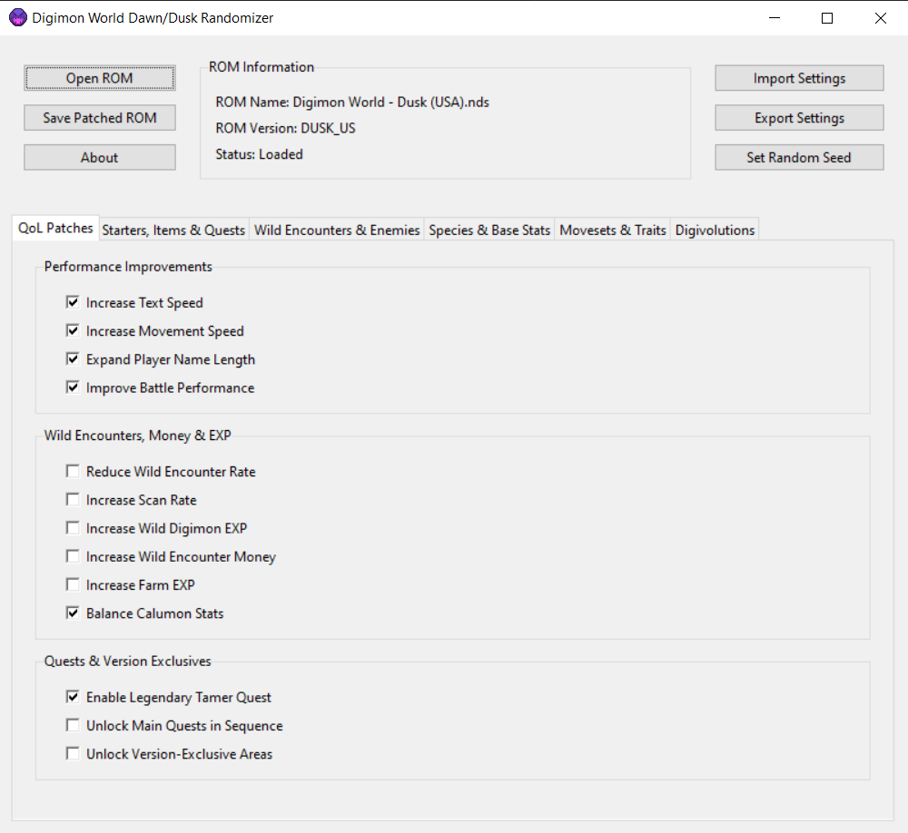

# Digimon World Dawn / Dusk Randomizer

Randomizer and quality-of-life feature patcher for the games **Digimon World: Dawn** and **Digimon World: Dusk**.

The information presented in these pages refers to the USA roms (serial codes NTR-A6RE-USA and NTR-A3VE-USA for Dusk and Dawn respectively).

## Contents
- [How To Use](#how-to-use)
    - [Windows](#windows)
    - [MacOS](#macos)
    - [Linux](#linux)
- [Run From Source](#run-from-source)
- [Features](#features)
    - [Quality-of-Life Patches](#quality-of-life-patches)
    - [Randomization Settings](#randomization-settings)
- [Known Issues](#known-issues)
- [Contact](#contact)
- [Acknowledgements](#acknowledgements)
- [Copyright Notice](#copyright-notice)

## How To Use

### Windows

1. Download the [latest release](https://github.com/joaomlsantos/DWDDRandomizer/releases/latest) of the Digimon World Dawn/Dusk Randomizer (`DWDDRandomizer_windows.zip`).
2. Unpack the downloaded files and launch `DWDDRandomizer.exe`.
3. Click `Open ROM` and open a valid .nds ROM of your game.
4. Pick your quality-of-life and/or randomization features and click `Save Patched ROM`. Give a name to your new patched ROM and choose the directory where to save the ROM, and click `Save`. A new .nds ROM will be generated with the chosen changes.

### MacOS

1. Download the [latest release](https://github.com/joaomlsantos/DWDDRandomizer/releases/latest) of the Digimon World Dawn/Dusk Randomizer (`DWDDRandomizer_macOS.zip`).
2. Launch `DWDDRandomizer.app`. If your system alerts `Apple could not verify "DWDDRandomizer" is free of malware that could harm your Mac or compromise your privacy`, close the warning, go to `Settings -> Privacy & Security`, scroll down to `"DWDDRandomizer" was blocked to protect your Mac`, and click `Open Anyway`.
3. Click `Open ROM` and open a valid .nds ROM of your game.
4. Pick your quality-of-life and/or randomization features and click `Save Patched ROM`. Give a name to your new patched ROM and choose the directory where to save the ROM, and click `Save`. A new .nds ROM will be generated with the chosen changes.

### Linux

1. Download the [latest release](https://github.com/joaomlsantos/DWDDRandomizer/releases/latest) of the Digimon World Dawn/Dusk Randomizer (`DWDDRandomizer-linux.tar.gz`).
2. Extract the archive by running `tar -xzvf DWDDRandomizer-linux.tar.gz`.
3. Open a terminal in the extracted folder and make sure the binary is executable by running `chmod +x DWDDRandomizer`, then run the application: `./DWDDRandomizer`.
4. Click `Open ROM` and open a valid .nds ROM of your game.
5. Pick your quality-of-life and/or randomization features and click `Save Patched ROM`. Give a name to your new patched ROM and choose the directory where to save the ROM, and click `Save`. A new .nds ROM will be generated with the chosen changes.

## Run From Source
This application was built with Python 3.9.0, but most other versions of Python3 should be compatible.

### Setup:

1. Ensure you have Python 3 installed on your system. If it is not installed, download it from [python.org](https://www.python.org/).
2. Clone or download this repository to your computer.
3. Install the required packages by running `pip install -r requirements.txt`.

### Running the UI application

- After having installed the required packages, run `python ui_tkinter.py` to launch the app.
- Set the desired randomization settings and click `Save Patched Rom`.
- You can also import existing randomization settings and export new randomization settings through the buttons `Import Settings` and `Export Settings`.

### Running the randomizer as a terminal script
- To run the randomizer as a single-line script, run ` python run_randomizer.py --rom rom_path --config config_path --output output_path`
- `--rom` corresponds to the path of your base Digimon World Dawn/Dusk rom
- `--config` corresponds to the path of your configuration file that contains the randomization settings
    - Base template files may be found in the `./configs` folder, and may be edited directly to produce the desired randomization settings
    - Additionally, you may set the randomization options through the UI and then export them to a file through the `Export Settings` button
- `--output` corresponds to the target output path of the randomized rom
- To see the randomization logs in the terminal, add the flag `--verbose` 
- Usage example: `python run_randomizer.py --rom ./DigimonWorldDusk.nds --config ./configs/balanced_randomization.toml --output ./DigimonWorldDusk_Randomized.nds` 

## Features

### Quality-of-Life Patches

Digimon World: Dawn and Dusk are both very charming games that also happen to have a set of very frustrating issues, the most glaring being how grind-heavy and slow-paced the games are. 

If you've played these games before, chances are that you recall some of the most negative points:
- Being constantly underleveled and having to grind encounters endlessly to keep up with the pace of the game; 
- Trying to reach an objective while in a dungeon and being completely swarmed with encounters;
- Feeling like the overall pacing of the game is *too slow*.

This tool aims to solve the above problems and provide a better game experience to everyone who plays this game, be it for the first time or as a re-run.

The following [**quality-of-life patches**](https://github.com/joaomlsantos/DWDDRandomizer/wiki/QoL-Patches) have been implemented so far:

**Performance Improvements**
- Increase Text Speed
- Increase Player Movement Speed
- Expand Player Name Length (from 5 to 7 characters)
- Improve Battle Performance

**Wild Encounters, Money & EXP**
- Reduce Wild Encounter Rate
- Increase Scan Rate
- Increase Wild Digimon Exp
- Increase Wild Encounter Money
- Increase Farm EXP
- Balance Calumon Stats

**Quests & Version Exclusives**
- Enable Legendary Tamer Quest
- Unlock Main Quests In Sequence
- Unlock Version-Exclusive Areas

### Randomization Settings

The following [**randomization options**](https://github.com/joaomlsantos/DWDDRandomizer/wiki/Randomizer-Options) have been implemented so far:
- Starter Packs
- Wild Digimon, Wild Encounter Rewards
- Quest Digimon, Tamers & Bosses
- Digivolutions, DNA Digivolutions
- Species, Base Stats, StatType, Resistances
- Movesets, Traits
- Overworld Items, Quest Item Rewards

See [this page](https://github.com/joaomlsantos/DWDDRandomizer/wiki/Randomizer-Options#near-future-randomization-features) for more details about the current randomization options and work-in-progress.

## Known Issues

- Some antiviruses may flag the executable as unrecognized, as it does not have a signed publisher. This is expected behavior; proceed by clicking "Run anyway" to open the randomizer.
- If you have an existing save file for your game, the digivolution + digivolution conditions randomization may cause visual issues on your current save file.
- Similar to the above, the player name length expansion patch is meant for new-game roms. Loading an existing base-game save into a patched rom may also cause visual issues.
- When increasing Farm EXP, the species EXP provided by certain terrains may not be properly displayed (particularly when the proivded EXP is above 1000). This is a graphical bug and does not influence the EXP earned by the digimon in that farm.
- When randomizing Enemy Tamers, Digimon & Bosses, non-scannable (boss-only) digimon are not yet randomized (Grimmon, SkullBaluchimon, etc).
- In both games, if any battle before the initial tournament battle against Koh/Sayo is lost, the game's logic will be broken as the player will be warped back to their HOME with no current known way to resume the events.

## Contact

For bug reports, questions or suggestions, please reach out via [Issues](https://github.com/joaomlsantos/DWDDRandomizer/issues), by email ([joao.l.santos@tecnico.ulisboa.pt](mailto:joao.l.santos@tecnico.ulisboa.pt)) or through twitter ([@ProjectHawke](https://twitter.com/ProjectHawke)).

## Acknowledgements

Most of the research work for this game was accomplished using [HxD](https://mh-nexus.de/en/hxd/), [DeSmuME](https://desmume.org/) and [Ghidra](https://ghidra-sre.org/).

The implemented user interface was heavily inspired by [Universal Pokémon Randomizer's](https://github.com/Ajarmar/universal-pokemon-randomizer-zx) design.

Special thanks to:

- [@Dreaker](https://github.com/Dreaker75), who composed a set of thorough [code notes](https://retroachievements.org/codenotes.php?g=16152) for these games and has been supporting this project's efforts through brainstorming, feature testing and listening to me yap about ROM editing for hours [:
- [@PocketRotom](https://github.com/PocketRotom), who helped me generate the macOS application release and found a couple of very critical bugs right before the initial release 🙏

## Support

Digimon World Dawn/Dusk Randomizer and the resources behind it are the result of countless hours of work and a deep passion for the Digimon series. If you’ve enjoyed using the tool, found the Wiki helpful, or simply want to support my efforts, consider contributing on Ko-fi.

Your support helps me continue working on projects like this, improving the tools, and sharing insights with the community. Thank you!

## Copyright Notice
Digimon World: Dawn/Dusk are owned by Bandai Namco Entertainment. I do not own, nor do I claim any rights to, the original game assets, code, or intellectual property associated with Digimon World Dawn and Digimon World Dusk. 

This repository and the tools within are provided for educational and personal use only. They are not intended for commercial use, nor for redistribution of copyrighted game assets.
